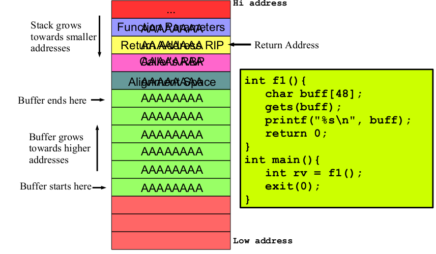
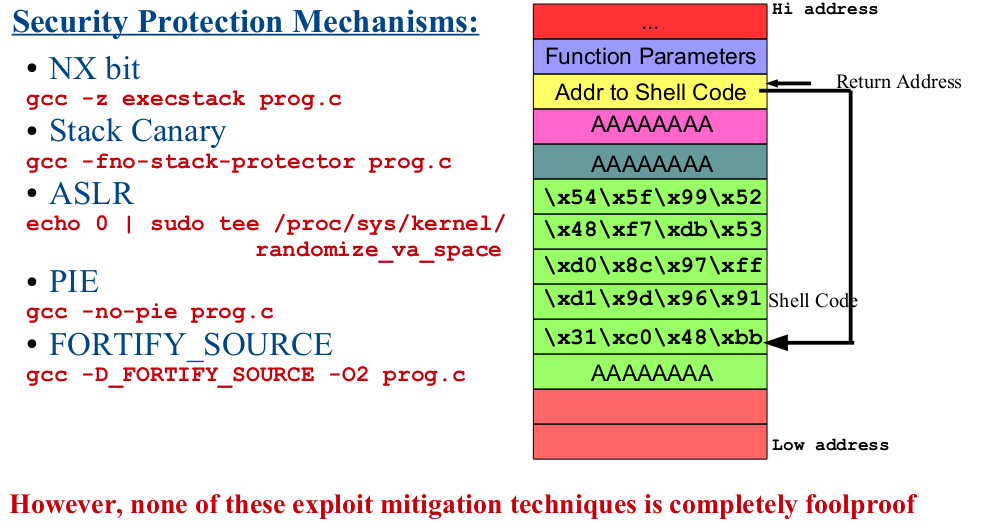
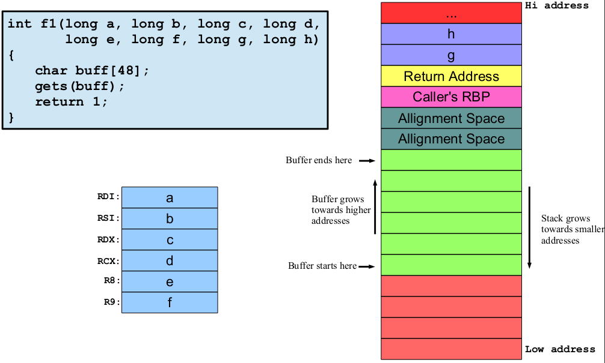

# Buffer Overflow (BOF)

A buffer overflow is a bug in a program, which occurs when more data is
written to a block of memory than it can handle. This can be stack based, heap
based, integer overflow, off-by-one, and a format string.

## Cyber Security and Vulnerabilities

[**Cyber-security**](https://www.simplilearn.com/tutorials/cyber-security-tutorial/what-is-cyber-security) encompasses all the techniques for **protecting**
computers, networks, programs, and data from unauthorized access or
attacks that are aimed for exploitation.

A [**vulnerability**](https://owasp.org/www-community/vulnerabilities/) is a flaw/weakness in a system design, implementation
or security procedure that could be exploited resulting in notable
damage. Example is a house with a weak lock on the main door. A **zero**-
**day** vulnerability is a vulnerability that has been disclosed but is not yet
patched. An exploit that attacks a zero-day vulnerability is called a zero-
day exploit.

An [**exploit**](https://ctf101.org/binary-exploitation/overview/) is a software that take advantage of a vulnerability leading to
privilege escalation on the target. **Example** of an exploit is the duplicate
key with the robber using which he/she can enter the house.

A [**payload**](https://www.baeldung.com/cs/exploit-vs-payload#:~:text=A%20payload%20is%20a%20code,reverse%20shells%2C%20and%20so%20on) is actual code which runs on the compromised system after
exploitation. Example is the task that the robber will perform inside the
house, i.e., **stealing jewelry and cash**.

### List of Common Security Vulnerabilities

---

This is a brief list of types of vulnerabilities that compromise [integrity, availability and confidentiality](https://www.certmike.com/confidentiality-integrity-and-availability-the-cia-triad/).

- ****Buffer overflow**
- Missing data encryption
- OS command injection
- SQL injection
- Missing authentication for critical function
- Missing authorization
- Unrestricted upload of dangerous file types
- Reliance on untrusted inputs in a security decision
- Cross-site scripting and forgery
- Download of codes without integrity checks
- Use of broken algorithms
- URL redirection to untrusted sites
- Path traversal
- Weak passwords
- Software that is already infected with virus

***The list grows larger every year as new ways to steal and corrupt data are discovered***

### Introduction to BOF

---

- The first published paper on this vulnerability was published in 1996 by **Aleph**
One with the title of “Smashing The Stack For Fun And Profit”, and later
revived by **Avicoder** in 2017.
- Buffer overflow exploit was first used by **Morris** **Worm** in 1988, followed by
**Code** **Red** **Worm** in 2001 and **Slammer** **worm** in 2003. It is still one of the top
vulnerability which cover a wide range of computer applications, libraries,
operating systems and networking
- Hackers mostly use buffer overflows to corrupt the **execution** **stack** of a web
app. By transferring fully crafted input to a web app, a hacker can make the
web app to execute **arbitrary** code and probably taking over the **server**.
- Although there are many **h/w and s/w** based techniques and tools that have
been proposed and developed to **detect** and **protect** from buffer overflow
vulnerability, but based on the trend it look likes this problem will continue to happen.

- [Stack Smashing](https://www.eecs.umich.edu/courses/eecs588/static/stack_smashing.pdf)
- [Smashing the Stack](https://avicoder.me/papers/pdf/smashthestack.pdf)



### Deep Dive in BOF

---

Certainly, let's dive into the details of a classic Buffer Overflow (BOF) vulnerability and how hackers exploit it step by step

#### Vulnerability Identification

Hackers identify a software component (such as a function) that doesn't properly validate input size.
This component allocates a fixed-size buffer (e.g., an array) to store user-provided data.

#### Crafting Payload

The hacker crafts input data that exceeds the buffer's allocated size.
The extra data overflows into adjacent memory, potentially overwriting other variables or control structures.

#### Return Address Manipulation

The hacker's goal is to manipulate the function's return address, stored on the stack, to point to their malicious code (shellcode).
They craft the payload so that the buffer overflows and overwrites the return address.

#### Stack Frame Manipulation

The stack frame of the vulnerable function includes local variables and the return address.
By controlling the return address, the hacker can redirect the program's execution flow.

#### Controlled Execution Flow

The hacker places their shellcode in the payload, often represented by assembly instructions.
The payload could be a sequence of instructions to spawn a shell, download malware, or perform other malicious actions.

#### Redirecting to Shellcode

When the vulnerable function returns, the manipulated return address points to the shellcode, not the legitimate caller.
This redirection leads to the execution of the hacker's shellcode.

#### Shellcode Execution

The shellcode executes, granting the hacker control over the compromised system.
The attacker can issue commands, access files, or exploit further vulnerabilities.

#### Privilege Escalation

If the exploited function has elevated privileges (e.g., runs as administrator), the hacker gains the same privileges.

#### Evasion Techniques

Hackers may use NOP sleds to increase the chance of hitting the shellcode precisely.
They may also modify the payload to avoid detection by intrusion detection systems.

#### Persistence and Exploitation

The hacker might set up backdoors or exploit other vulnerabilities to maintain access or pivot to other systems.

#### Cleanup and Concealment

To cover their tracks, attackers erase logs, manipulate system settings, or deploy anti-forensics techniques.

### Security Protection Mechanisms

---

#### NX Bit

The NX (No-eXecute) bit, also known as the **XD (eXecute Disable)** bit, is a **hardware**-based security feature found in modern computer processors. It is designed to prevent the **execution of code** stored in certain memory regions, primarily as a defense against various types of **malicious** software attacks, including Buffer Overflow (BOF) attacks and code injection.

```bash
gcc -z execstack programname.c
```

- The NX bit doesn't prevent all **types** of code execution attacks, such as those that involve **abusing** **legitimate** code **sequences**.

#### Stack Canary

Before calling a function, the program places a random value (the stack canary) between the local variables and the return address on the stack.
After the function executes, before it returns, the program checks if the canary value has been modified.

```bash
gcc -fno-stack-protector programname.c
```

- Stack canaries cannot prevent all types of buffer overflows or attacks that don't target the return address.

#### ASLR (Address Space Layout Randomization)

ASLR randomizes the starting addresses of various memory segments, including the stack, heap, libraries, and executable code, in a process's address space.
This randomization is applied when the process starts, making it challenging for attackers to predict memory locations.

```bash
echo 0 | sudo tee /proc/sys/kernel/randomize_va_space
```

#### PIE (Position Independent Executable)

PIE is an extension of **ASLR** that focuses specifically on the **executable** code and data of an application.In a **non**-PIE executable, the base **address** of the program's code is fixed, making it easier for attackers to predict and target specific memory locations. With **PIE**, the base address of the executable's code is **randomized** each time the program is executed.

```bash
gcc -no-pie programname.c
```

- Like ASLR, PIE is not **foolproof** and doesn't prevent all possible exploitation scenarios.
- PIE may introduce a small performance overhead due to the need to adjust relative offsets during runtime.

#### Fortify_source

Fortify Source is integrated into the software development lifecycle, helping developers find and fix issues early in the development process.
It can be integrated into integrated development environments (IDEs) or run as part of automated build processes. Fortify Source allows organizations to define their own security rules and policies based on industry best practices, compliance requirements, and internal security standards.

```bash
gcc -D_FORTIFY_SOURCE -O2 programname.c
```

<br>

### Shellcode

---

**Shellcode** refers to a small piece of code that is typically written in **assembly** language and designed to be injected and executed directly in a compromised system's memory. **Shellcode** is a fundamental component of many types of cyber attacks, including buffer overflow **exploits**, code **injection** attacks, and remote code execution. Its primary purpose is to provide attackers with a way to gain **unauthorized** access or **control** over a system.

- ***One common use of shellcode is to create a reverse shell, where the compromised system connects back to the attacker's system, allowing them to interact with the compromised machine.***



### Machine, Assembly and Hi Level Languages

---

#### High level language

```C
#include <stdio.h>
#include <stdlib.h>

int main(){
printf("I am High level Language C\n");
exit(0);
}
```

#### Assembly language

```asm
section .data
    message db "I am High level Language C", 0

section .text
    global main
    extern printf, exit

main:
    push message
    call printf
    add esp, 4
    push 0
    call exit
```

#### Machine code

Assembly Code                |    Hexadecimal Machine Code
----------------------------|-------------------------------

```
push message                |     68 xx xx xx xx 
call printf                 |     E8 xx xx xx xx 
add esp, 4                  |     83 C4 04 
push 0                      |     6A 00 
call exit                   |     E8 xx xx xx xx

```

### Assembly Language

---

Assembly language plays a crucial role in buffer overflow exploits. Buffer overflow exploits involve manipulating the memory contents of a vulnerable program to overwrite critical data, such as function return addresses, and redirect the program's execution flow to malicious code. Assembly language is used to craft the shellcode or payload that will be injected and executed in the compromised system's memory.

- Check **Assembly** **language** from my [intelx86-64](https://github.com/meharehsaan/intelx86_64) repository where I explained assembly from zero with examples in detail.
- [Endianness](https://github.com/meharehsaan/intelx86_64/tree/master/datatypes#endianness)
- [Flag Registers](https://github.com/meharehsaan/intelx86_64#flags-register-eflagsrflags)
- [General Purpose Registers](https://github.com/meharehsaan/intelx86_64#registers)
- [Functions](https://github.com/meharehsaan/intelx86_64/tree/master/functions#proceduresfunctions-in-assembly-language)
- [Function calling conventions](https://github.com/meharehsaan/intelx86_64/tree/master/funcallconvention#c-function-calling--the-run-time-stack)
- [Stack Behind the Curtain](https://github.com/meharehsaan/system-programming/tree/master/stack-behind-the-curtain#stack) from system programming.
- [Basic Assembly Instructions](https://github.com/meharehsaan/intelx86_64)

### Function Stack Frame

---



### Common Debuggers / Code Analyzers

---

- [GDB](https://github.com/meharehsaan/intelx86_64/tree/master/gdb)

## Links

- [BOF01](https://owasp.org/www-community/vulnerabilities/Buffer_Overflow)
- [BOF 02](https://www.jsums.edu/nmeghanathan/files/2015/05/CSC437-Fall2013-Module-5-Buffer-Overflow-Attacks.pdf)
- [BOF in detail](https://infosecwriteups.com/buffer-overflow-basics-687f61216ebc)
- [Buffer Overflows](https://courses.cs.washington.edu/courses/cse351/20sp/lectures/15/CSE351-L15-buffoverflow_20sp-ink.pdf)
- [Binary Exploitation](https://dmz.torontomu.ca/wp-content/uploads/2021/03/Binary-Exploitation-201.pdf)
- [Buffer Overflow Attack](https://web.ecs.syr.edu/~wedu/seed/Book/book_sample_buffer.pdf)
- [Buffer Overflow Defenses](https://cseweb.ucsd.edu/classes/wi22/cse127-a/scribenotes/3-bufferoverflowdefenses-notes.pdf)
- [Bypass defenses](https://www.appknox.com/security/bypassing-pie-nx-and-aslr)
- [Stack Guard](http://myweb.usf.edu/~kevindennis/wcsc/defense.pdf)
