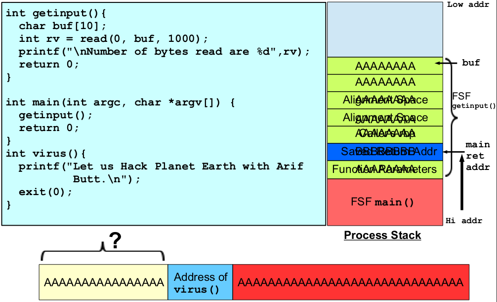
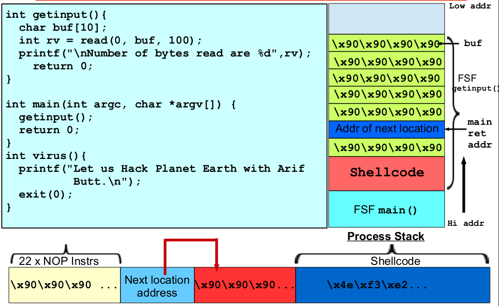
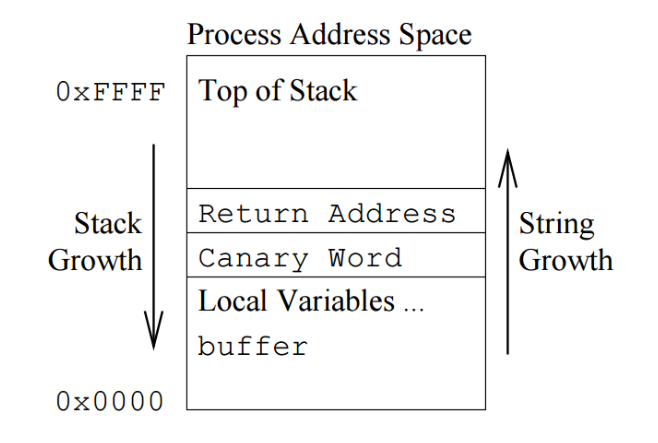

# Exploiting BOF Vulnerability

An exploit is a **piece** of software or a sequence of commands designed to take **advantage** of a **vulnerability** in a system, application, or software component. The goal of an exploit is to **trigger** **unintended** behavior or gain **unauthorized** access to a computer system, network, or application. Exploits are used by security **researchers**, penetration testers, and hackers to **identify** and **demonstrate** vulnerabilities and **weaknesses** in software and systems.

### Related Terms

---

#### Vulnerability

A vulnerability is a **weakness** in a software application, system, or configuration that can be **exploited** to **compromise** the integrity, availability, or confidentiality of the system. Vulnerabilities can include buffer overflows, SQL injection, cross-site scripting (XSS), and more.

#### Exploit Payload

The payload is the **portion** of the exploit that contains the **code** to be **executed** once the **vulnerability** is **exploited**. Payloads can range from simple actions like **displaying** a message to executing arbitrary **commands**, spawning a remote **shell**, or gaining administrative **privileges**.

#### Exploitation

The process of exploitation involves crafting a payload that takes **advantage** of a **specific** vulnerability. This often involves **manipulating** memory, input data, or system behavior to cause the **desired** outcome.

#### Zero-Day Exploit

A zero-day exploit **targets** a vulnerability that is not **publicly** known or patched by the software vendor. These exploits can be **highly** **valuable** to attackers, as **defenders** haven't had a chance to **address** the vulnerability.

#### Ethical Hacking

Ethical hackers and penetration testers use exploits to **identify** security **weaknesses** in systems and applications. They follow ethical guidelines and work within **legal** **boundaries** to help organizations improve their **security** posture.

#### Black Hat and Malicious Use

Black hat hackers, also known as **malicious** **hackers**, use exploits for **unauthorized** and often **illegal** activities. Their motives might include financial gain, data theft, or causing **disruption**.

#### Mitigation

Organizations deploy **security** measures to mitigate the **risk** of exploitation. These measures include patching vulnerabilities, implementing intrusion detection systems, firewalls, and applying security best **practices**.

### Exploiting Vulnerability

---

#### Part I

Find and understand the vulnerability in the program
Give it an input string such that the control of flow move to some
piece of code of our choice within the code section.

#### Part II

- Write / Get the shellcode
- Craft the input string such that the control of flow shifts to your
shellcode residing on the stack.
- Inject the shellcode by giving this input string to the vulnerable program.
- Test it inside the debugger.
- Test it outside the debugger.

### Code Integrity Protection

---

By default **protections** by **OS**

- The code integrity property is ensured by making the process
**stack, heap, and data** sections as **non**-**executable** and the text
section as **non**-**writable**, which is the default settings in most
modern operating systems.
- To make the stack **executable** we can set the **NX** (Non-
Executable) bit in x86. A programmer can set this bit during
linking phase by giving the **-z noexecstack** option to gcc.
- The text section is also by default non-writable, and this is also
enforced by **memory** access **permissions** using **virtual** memory (in
the page table).

### Bypassing Code Integrity Protection

---

- You can bypass Code Integrity Protection by using a class of
attacks known as **return-to-libc**, in which you **divert** the
control flow to C library function **system**() with the /bin/sh
**parameter**. The fact that the vast **majority** of programs are linked
with the C library makes this pretty easy. This technique of
attacks is also known as **Return-Oriented-Programming (ROP)**, in
which you reuse existing code in the program, the attacker may
reuse small pieces of program code called “**gadgets**” to execute
**arbitrary** **(turing-complete)** operations.
- You can bypass Code Integrity Protection by making the stack
executable at run-time, e.g., by calling **mprotect**(), which is
used to change the access protections for the **calling process's**
memory page containing the **stack**.

### Address Space Layout Randomization (ASLR)

---

ASLR **randomizes** the address of stack, heap and hared library sections in a
process address space. Every time a program executes it is given different
addresses, thus preventing an attacker from reliably jumping to an **exploited**
function in memory.

- Linux allows 3 options for its ASLR implementation that can be configured
in **/proc/sys/kernel/randomize_va_space** file. Writing 0, 1, or
2 to this will results in the following behaviors
  - 0: deactivated
  - 1: random stack, vdso, libraries; data is after code section
  - 2: random data too
  - The stack is easily **randomizable**, as all stack addresses are relative to rsp or rbp. Similarly data section can also be randomized, if address of data segment is set to a random value.
  
- The Code can only be **randomized** by compiling the program as Position
**Independent** Code/Position Independent Executable. This is the default for
shared libraries, but otherwise executable code is usually placed at **fixed**
addresses. 

*Note that **randomization** occurs at **load-time**, which means that the **segment** addresses do not change while the **process** is running.*

### Bypassing - Address Space Layout Randomization

---

- **Bruteforce**. If the attacker is able to inject payloads **multiple** times without
crashing the application, they can **bruteforce** the address they are interested
in (e.g., a target in libc). Otherwise, they can just run the **exploit** multiple
times until they guess the **correct** target.
- **NOP sled**. In the case of shellcodes, a longer NOP sled will maximize the
chances of **jumping** inside it and eventually reaching the **exploit** code even if
the stack address is **randomized**.
- **Restrict entropy**. There are various ways of **reducing** the entropy of the
**randomized** address. For example, the attacker can decrease the **initial** stack
size by setting a huge amount of dummy **environment** variables.
- **Information leak**. The most effective way of bypassing **ASLR** is by using
an information leak **vulnerability** that exposes a **randomized** address, or at
least parts of it. The attacker can also dump parts of libraries (e.g., libc) if
they are able to create an exploit that reads them. This is useful in remote
attacks to infer the version of the library, downloading it from the web, and
thus knowing the right GOT offsets for other functions (not originally linked
with the binary).

### Stack Protection (Canaries)

---

- A stack **canary** is a known value or word that is placed just below the **return**
address on the **stack** to monitor buffer overflow. A copy of this word is
saved some where else as well. When the hacker overwrites the return
address using a buffer overflow the **canary** will also be **overwritten**. When a
function calls return this canary value is **compared** with a a **saved** else where copy and a **mismatch** indicates that the **stack** is over wirtten. To disable this security option we can compile the program using **-fno-stack-protector** option to **gcc**.
- Stack canaries only **protect** against buffer overflows. **Arbitrary** memory
writes (e.g. to offsets that can be controlled by the attacker) may be **crafted**
so that they do not touch the canary value. **Guessing** the canary value, e.g.
through an **information leak or through brute force**, is **possible** and will
bypass the attack. Search out more options that can be used to override
this protection mechanism.

### Links

- [Defenses BOF](https://cseweb.ucsd.edu/classes/wi22/cse127-a/scribenotes/3-bufferoverflowdefenses-notes.pdf)
- [Stack Canary](https://edk2-docs.gitbook.io/a-tour-beyond-bios-mitigate-buffer-overflow-in-ue/stack_canaries)
